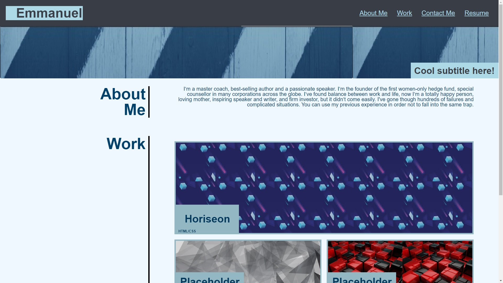

# professional-portfolio-challenge
The goal of this project was to build a webpage profession portfolio from scratch.  This portfolio will have live working links, links to sections of the webpage, and the portfolio will use flexbox, media query, and variables in the css.  

This application is a website of a professional portfolio. 

There was a lot of challenges that I went through when building this website.  One challenge was figuring out how to have headers for each section display on the left side of the page, while having text on the right side.  I succeeded in the challenge by giving a left and right class to both divs, and giving the classes different positionings in the css.  

[Professional Portfolio](https://emmanueljatto.github.io/professional-portfolio-challenge/)